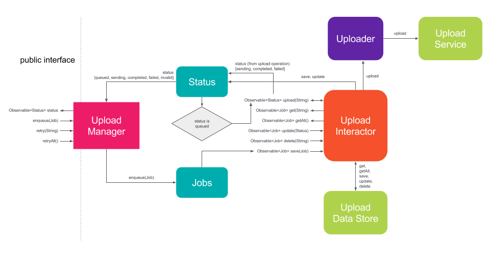

RxUploader for Android
=======

A reactive Uploader for [Android][1] using [RxJava][2] and [OkHttp][3]



Installation
=======
Add the following dependency to your project build.gradle file:
(note: Gradle is the only supported build configuration at this time)
```
dependencies {
  compile 'com.github.jsaund:rxuploader:0.0.2'
}
```

Usage
=======
A new instance of the `UploadManager` can be constructed via the `UploadManager.Builder`.
```
final UploadManager uploadManager = UploadManager.builder()
    .withUploadDataStore(dataStore)
    .withUploadService(service)
    .withUploadErrorAdapter(errorAdapter)
    .build();
```

Clients must implement a `UploadService` and `UploadErrorAdapter`. Optionally, clients can implement the `UploadDataStore` or use a `SimpleUploadDataStore` which persists Jobs to SharedPreferences.

The `UploadService` defines the interface for the `UploadManager` to interact with the remote server responsible for accepting files to be uploaded.

The `UploadErrorAdapter` defines which exceptions can be retried and what `ErrorType` they map to.

The `UploadManager` provides methods to `enqueue` a new Job, subscribe to `status` updates, and `retry` failed Jobs.

See rxuploader-sample project for a complete example.

Dependencies
=======

[RxJava][2]

[OkHttp][3]

[Gson][4]

[AutoValue][5]

[AutoValue-Gson][6]

[Retrolambda][7]

License
=======

    Copyright 2017 Jag Saund

    Licensed under the Apache License, Version 2.0 (the "License");
    you may not use this file except in compliance with the License.
    You may obtain a copy of the License at

       http://www.apache.org/licenses/LICENSE-2.0

    Unless required by applicable law or agreed to in writing, software
    distributed under the License is distributed on an "AS IS" BASIS,
    WITHOUT WARRANTIES OR CONDITIONS OF ANY KIND, either express or implied.
    See the License for the specific language governing permissions and
    limitations under the License.

[1]: https://developer.android.com
[2]: https://github.com/ReactiveX/RxJava
[3]: https://github.com/square/okhttp
[4]: https://github.com/google/gson
[5]: https://github.com/google/auto/tree/master/value
[6]: https://github.com/rharter/auto-value-gson
[7]: https://github.com/evant/gradle-retrolambda
